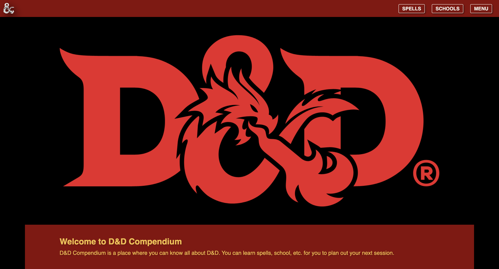

# D&D Compendium
The D&D Compendium is a fully responsive web app built from scratch as an interactive resource for D&D players, currently in development. With a sleek, user-friendly design and a third-party API powering dynamic search across spells, classes, races, and more, it provides an engaging, intuitive experience that puts all the information players need right at their fingertips.

**Link to project:** https://dnd-compendium.onrender.com/



## How It's Made:

**Tech used:** <a href="https://developer.mozilla.org/en-US/docs/Web/HTML" target="_blank" rel="noreferrer"> </a>
<a href="https://developer.mozilla.org/en-US/docs/Web/CSS" target="_blank" rel="noreferrer"> </a>
<a href="https://developer.mozilla.org/en-US/docs/Web/JavaScript" target="_blank" rel="noreferrer"> </a>
<a href="https://nodejs.org/en/" target="_blank" rel="noreferrer"> </a>
<a href="https://react.dev/" target="_blank" rel="noreferrer"> </a>
<a href="https://expressjs.com/" target="_blank" rel="noreferrer"> </a>
<a href="https://render.com/" target="_blank" rel="noreferrer"> </a>

I built an API-driven spell search as the first major feature of the compendium. The scope will expand over time to cover monsters, subclasses, and other core D&D systems, but spells were the natural starting point given how much data each one carries.

Spells in D&D aren't uniform. Some deal flat damage, some scale with slot level, some have saving throws, some heal. To reflect that, I pulled in attributes like higher level effects, damage/heal at slot level, attack type, components, and more. The goal was to give users a complete picture of each spell without requiring them to cross-reference external sources.

I structured the project with dedicated HTML, CSS, and JavaScript files per section. As the compendium grows, this keeps each domain isolated and easier to maintain.

I started by building out the HTML to mirror the structure of the API response, then added a search input so users could query any spell by name:
```
<section id="search-box">
	<div class="text-content">
		<h1 class="uncial title">Spell Directory</h1>
		<p>Type in a spell</p>
		<input type="text" class="bar" name="" value="">
		<button type="button" class="src-btn" name="button">Get Spell</button>
	</div>
</section>
```
The spell detail layout was structured to accommodate every possible attribute a spell might return, including nested data like class lists, subclasses, and slot-level scaling:
```
<main id="spell-bio">
	<h2 class="spell-name uncial">Spell</h2>
	
			
			
	<section class="key-facts">
		<section class="text">
			<h2 class="uncial">Level: <span class="level reg-font"></span></h2>
			<h2 class="uncial">School: <span class="school reg-font"></span></h2>
			<h2 class="uncial">Description: <span class="description reg-font"></span></h2>
			<ul class="descript-slot reg-font"></ul>
			<h2 class="uncial">Higher Level: <span class="high-level reg-font"></span></h2>
			<ul class="high-level-descript-slot reg-font"></ul>
			<h2 class="uncial">Attack Type: <span class="attack-type reg-font"></span></h2>
			<h2 class="uncial">Damage Type: <span class="damage-type reg-font"></span></h2>
			<h2 class="uncial">Damage/Heal at Slot Level: <span class="reg-font"></span></h2>
			<ul class="damage-heal-slot reg-font"></ul>
			<h2 class="uncial">Casting Time: <span class="cast-time reg-font"></span></h2>
			<h2 class="uncial">Range: <span class="range reg-font"></span></h2>
			<h2 class="uncial">Components: <span class="one-comp reg-font"></span></h2>
			<ul class="components reg-font"></ul>
			<h2 class="uncial">Duration: <span class="duration reg-font"></span></h2>
			<h2 class="uncial">Concentration: <span class="concentration reg-font"></span></h2>
			<h2 class="uncial">Ritual: <span class="ritual reg-font"></span></h2>
			<h2 class="uncial">Material: <span class="material reg-font"></span></h2>
			<h2 class="uncial">Class(es): <span class="one-class reg-font"></span></h2>
			<ul class="class-list reg-font"></ul>
			<h2 class="uncial">Subclass(es): <span class="one-subclass reg-font"></span></h2>
			<ul class="subclass-list reg-font"></ul>
		</section>
	</section>
</main>
```

On the JavaScript side, I used the base API URL and appended the user's search input via template literals to dynamically build each request. The response gets stored in a variable called spell for easy reference throughout the script. From there, individual variables pull out specific fields using document.querySelector to inject data into the correct elements. Nested objects like subclasses and slot-level damage are broken into their own variables and rendered using forEach loops to append each item to its list dynamically.

To keep the UI clean between searches, I wrote a helper function that wipes all displayed data before rendering new results. It works alongside the error handler and a spell-name validation check, so if a user submits an empty field or searches for a spell that doesn't exist, the page clears and surfaces the appropriate message.

## Optimizations
The layout is solid, but there are both structural and feature gaps that need to be addressed.

On the feature side, a browsable spell list is still missing. Right now, users have to know a spell's name before they can search for it, which is a problem for newer players still learning the game. If someone has to Google what spells exist just to use this tool, the compendium is creating the exact friction it's supposed to eliminate. The spell detail card also needs to be resized. It currently fills the entire viewport, leaving empty space that hurts the visual balance of the page.

On the code side, the current vanilla JavaScript implementation duplicates components across pages in a pattern that's neither DRY nor scalable. Migrating to React is the logical next step. Reusable components and hooks like useEffect will reduce redundancy, improve maintainability, and make both of these feature additions easier to implement and manage.

### Development log coming soon

## Lessons Learned:
Building this in vanilla JS first gave me a clear picture of where the friction points are. The biggest takeaway: frontend frameworks like React aren't just convenience, they're architecture. Reusable components and a structured component tree become essential once a project grows beyond a few pages.

## More Projects:
Feel free to explore some of my other projects in my portfolio:

**Source:** [Source](https://github.com/NomadCode33/DevChronicles/tree/main/Source)

**Ayesha Hair Salon:** [Ayesha Hair Salon](https://github.com/NomadCode33/DevChronicles/tree/main/Ayesha-Hair-Salon)

## Repositories
**Profile:** [NomadCode33](https://github.com/NomadCode33)

**Main Repository:** [DevChronicles](https://github.com/NomadCode33/DevChronicles)
