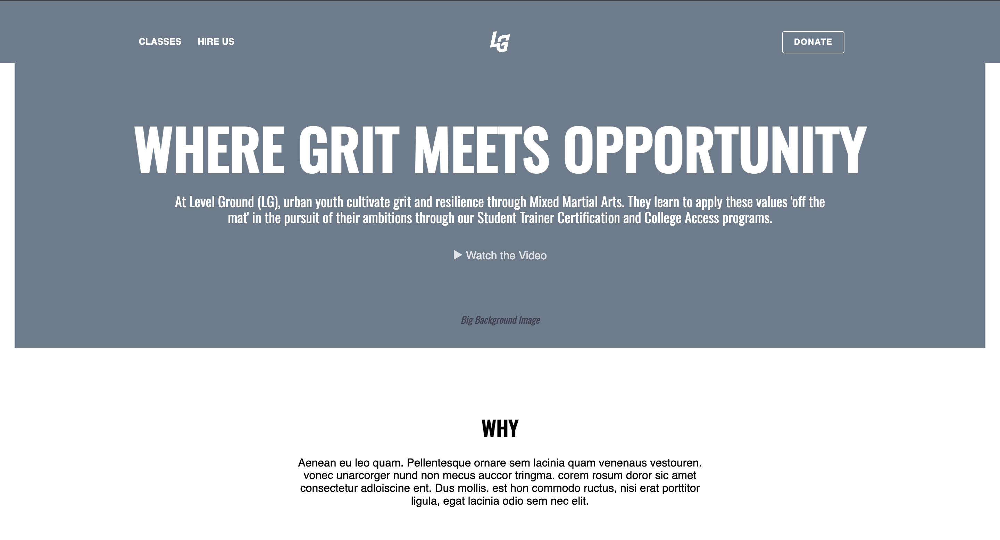

# Level Ground
A nonprofit website layout for Level Ground, built with HTML/CSS from a professional mockup. Highlights include a clear message, impact sections, and a contact area—designed to communicate mission and drive user engagement.

**Link to project:** https://levelground-layout-nomadcode33.netlify.app/

## How It's Made:

**Tech used:**  
   

I wrote down the base structure of the code just to get it down and focus on the process later. I then saw that there were five sections of the website and decided to break things down from there. I was using floats at the time so I knew just by looking at certain parts where floats were necessary. The first section had the navigation at the top where I used floats to make them neat together. The rest of the content I was able to put the elements out normally and style them with proper spacing. The second section was the why section. I used adequate spacing for the CSS which included proper padding.

The third section was easily the second hardest section here. I noticed that both sections of the visit options were identical. So I grouped each of them in different sections with the same class since they were both identical. I then tweaked the button found from the navigation section and adjusted the measurements to make them bigger. After I put the content for each of the visit columns, I then floated them together to make them flush side by side. The fourth section is identical to the second section with the why, but this time it included the button. So I used the same framework from the why and repurposed it with a button meant to redirect the user to a page with volunteer opportunties.

The fifth section was the hardest due to the combination of factors. After I glanced at what to do I was slowly piecing it together and got into the groove of it. Each section was split up into smaller subsections of using floats to make it match exactly like the mockup. After everything was done with the sections, I made sure to find font that was similar to make sure it had a unique, bold, and feeling of presence to make it pop out to people.

## Optimizations
It's a minor change but I made the website look a bit different with the white edges on the side of the screen. It gives the website a more modern sleek look to it as it's very pleasing to the eyes. I also want to make it distinct.

I saw the bottom section with all the social media links. It was tough to see at first until I saw everything as boxes when doing floats. It was at this point that everything clicked with floats. I realized that floats was just boxes. By counting how many boxes there are and doing the correct math for the proper spacing, I was able to crack the code and see the pattern. I was able to fly through in no time.

## Lessons Learned:

## More Projects:
Feel free to explore some of my other projects in my portfolio:

**DragonDex:** [DragonDex](https://github.com/NomadCode33/DevChronicles/tree/main/DragonDex)

**Personal Website:** [Website](https://github.com/NomadCode33/DevChronicles/tree/main/Portfolio)

## Repositories
**Profile:** [NomadCode33](https://github.com/NomadCode33)

**DevChronicles Repository:** [DevChronicles](https://github.com/NomadCode33/DevChronicles)

**Main Repository:** [NomadGeo](https://github.com/NomadCode33/NomadGeo)
