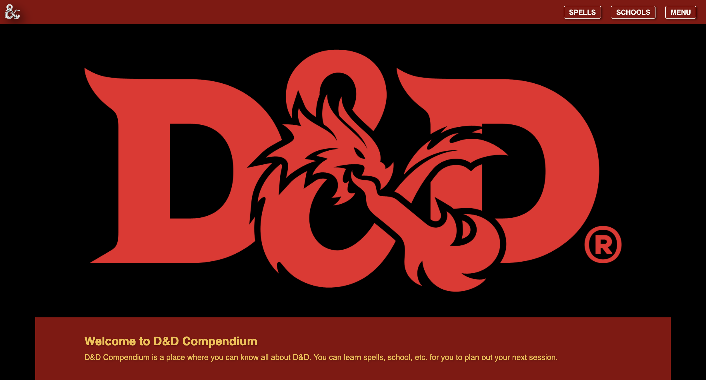

# D&D Compendium
## WORK IN PROGRESS
**Updates will be prevalent in the dev log regarding its progress**

**Link to project:** *Will be provided once project is complete*

## How It's Made:

**Tech used:** 

*Description will be available after the project is complete*

## Dev Log
**Date:** 

## Lessons Learned:
*Summary will come after the project is complete*

## More Projects:
Feel free to explore some of my other projects in my portfolio:

**Source:** [Source](https://github.com/NomadCode33/DevChronicles/tree/main/Source)

**Ayesha Hair Salon:** [Ayesha Hair Salon](https://github.com/NomadCode33/DevChronicles/tree/main/Ayesha-Hair-Salon)
 
 

**Profile:** [NomadCode33](https://github.com/NomadCode33)
